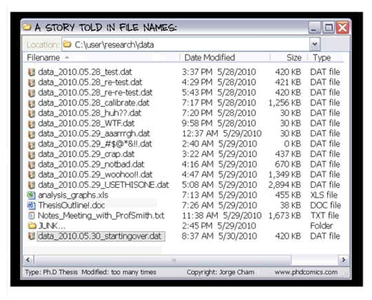

The Benefits of Version Control
*******************************

Version control is a system that records changes to a file or set of files over time so that you can recall specific versions later.
The benefits are at hand:

- Track incremental backups and recover:
      Every document can be backed up automatically and restored at a second's notice.
- Track every change:
      Every infinitesimal change can be recorded and can be used to revert a file to an earlier state.
- Track writing experiments:
      Writing experiments can be sandboxed to copies while keeping the main file intact.
- Track co-authoring and collaboration:
      Teams can work independently on their own files, but merge them into a latest common revision.
- Track individual contributions: 
      Good VCS systems tag changes with authors who make them.

git at a Glance
===============

git commands
------------

The git tool has many subcommands that can be invoked like `git <subcommand>` for instance `git status` to get the status of a repository.

The most important ones (and hence the ones we'll be focusing on) are:

init:
  initialize a repository
clone:
  clone a repository
status:
  get information about a repository
log:
  view the history and commit messages of the repository
add:
  add a file to the staging area
commit:
  commit your changes to your **local** repository
push:
  push changes to a **remote** repository
pull:
  pull changes from a **remote** repository
checkout:
  retrieve a specific version of a file

you can read more about each command by invoking the help: ::

 git commit --help
 git help commit

git concepts
------------

commit
^^^^^^

A commit is a recorded set of changes in your project's file(s).
Try to group *logical* sets of changes together into one commit -- don't mix changes which are unrelated.

repository
^^^^^^^^^^

A repository is the history of all your project's commits.

working copy
^^^^^^^^^^^^

A working copy is a *local* version of the files of a repository.
It is the set of files you are *working* on; 
they become part of a repository by `commiting` them.

git settings
============

Setting your identity
---------------------

Before we start, we should set the user name and e-mail address.
This is important because every git commit uses this information 
and it's also incredibly useful when looking at the history and commit log: ::

 git config --global user.name "John Doe"
 git config --global user.email johndoe@embl.de

Other useful settings include your favorite editor, enabling color output as
well as difftool: ::

 git config --global core.editor nano
 git config --global color.ui auto
 git config --global merge.tool kdiff3

Checking Your Settings
----------------------

You can use the `git config --list` command to list all your settings: ::

 git config --list
 user.name="John Doe"
 user.email=johndoe@embl.de
 core.editor=vim
 merge.tool=meld
 color.status=auto
 color.branch=auto
 color.interactive=auto
 color.diff=auto
 ...

A Typical git Workflow
**********************

.. figure:: _static/git-local.png
    :scale: 85 %

    Files are `added` from the `workspace`, which always holds the current
    version of your files, to the `staging area`. `Staged` files will be stored
    into the local repository in the next `commit`. The repository itself
    contains all previous versions of all files ever committed.

.. figure:: _static/git-remote.png

    Distributed workflow using a centralized repository. Here, you use `push`
    and `pull` to synchronize your local repository with a remote repository.

Creating a git Repository
=========================

Turning an existing directory into a local git repository is as simple as changing
into that directory and invoking `git init`. However, here we
want to create one repository which we can use from multiple other folders to
sync to/from, therefore in this case, we need to initialize it as a `bare`
repository. 

.. note:: Normally you do not need the `--bare`, but it's essential for this
          exercise...

So, here we first create an empty directory in our homedirectory called `repos`
(this is meant to hold and serve all our repositories), and create a repository
in there called `mythesis`: ::

 mkdir ~/repos
 cd ~/repos
 mkdir mythesis
 cd mythesis
 git init --bare

.. note:: As a result, you should have the directory `~/repos/mythesis` and there
          should be a directory called `.git` in this directory...

Cloning a git Repository
========================

Next, we can `clone` this repository into the `~/Documents/mythesis` folder.::

  cd ~/Documents

  git clone ~/repos/mythesis

  Initialized empty Git repository in /localhome/training/Desktop/mythesis/.git/
  warning: You appear to have cloned an empty repository.

  cd mythesis

By `cloning`, we not only get the exact copy as the remote side, but we
automatically tell git where we had got the data from, which allows us later to
sync our changes back...

.. note:: You can clone from either a different folder on our computer, a remote machine (via ssh), or a dedicated git server::

 Local directory: ::
 
  git clone ~/repos/mythesis
 
 Remote directory: ::
 
  git clone ssh://remote_user@remote_server/mythesis.git
 
 Remote git server: ::
 
  git clone git@server:user/project
 

Checking the Status
===================

If you don't know in which state the current repository is in, it's always a
good idea to check: ::

 git status

 # On branch master
 #
 # Initial commit
 #
 nothing to commit (create/copy files and use "git add" to track)

Here, everything is clear, not much going on (no news is good news).

.. note:: In fact, it's good practice, to use `git status` as often as
          possible!

Adding files
=============

First, we'll create a new file: ::

 echo "My first line towards a great paper!" > paper.txt

 git status

 # On branch master
 #
 # Initial commit
 #
 # Untracked files:
 #   (use "git add <file>..." to include in what will be committed)
 #
 #       paper.txt
 nothing added to commit but untracked files present (use "git add" to track)

Here, git tells us that there is a file, however it's `untracked`, meaning git
does not know/care about it. We need to tell git first that it should keep track
of it. So we'll add this file to the so called `staging area`: ::

 git add paper.txt

 git status

 # On branch master
 #
 # Initial commit
 #
 # Changes to be committed:
 #   (use "git rm --cached <file>..." to unstage)
 #
 #       new file:   paper.txt
 #

This tells us that the `paper.txt` has been added and can be committed to the
repository.

Committing changes
==================

It might be a bit confusing at first to find out that `git add` does **not** add a file to the repository.
You need to `commit` the file/changes to do that: ::

 git commit -m "message describing the changes you made"

.. note:: You **MUST** provide a commit message! git will ignore your attempt to commit if the message is empty. 
 If you do not provide the `-m` parameter, git will open an editor in which you should write your commit message (can be multiple lines of text). 
 Once you save/quit your editor, git will continue to commit...

After succesfully committing, we can check the status again: ::
 
 git status

 # On branch master
 nothing to commit, working directory clean

Viewing the History
===================

You can use `git log` to view the history of a repository. All previous commits including details such as 
Name & Email-address of the committer, Date & Time of the commit as well as the actual commit message are shown: ::

 git log

 commit  <some hash value identifying this commit>
 Author: <your name and email address>
 Date:   <the actual date of the commit>

 message describing the changes you made

Exercise
--------

Repeat the add/commit procedures you just learned. Add more files, use an editor
to add more content to the `paper.txt` file, commit your changes providing a
meaningful commit message.

Pushing changes
===============

In order to exchange/synchronize your changes with a remote repository, you use `git push`/`git pull`:

.. figure:: _static/git-remote.png

To push all committed changes, simply type: ::

 git push

.. note:: git "knows" from which location you had cloned this repository and will try to 
 push to exactly that location (using the protocol you used to clone: ssh, git, etc)...

.. warning:: If you get a warning message, read it carefully! The most common
    error you get when trying to push are changes on the remote end which you first
    need to merge into your local repository before you are allowed to push your own...

Creating a second clone
-----------------------

In order to simulate contrubting to our repository from another computer, we will again
checkout the repository, but this time in a different folder named `mythesis-work`::

  cd ~/Documents

  git clone ~/repos/mythesis mythesis-work

  cd ~/Documents/mythesis-work

This repository should contain all the changes you've pushed so far.
Now we want to improve our `paper.txt` document. Use an editor to add more lines
to this file::

  echo "This line was contributed from work..." >> paper.txt

Again, `add`, `commit`, and `push` your changes.

Pulling changes
===============

To update your local repository with changes from others, you need to `pull` these changes.
In a centralized workflow you actually **must** pull changes that other people have contributed, before you can submit your own. ::

 git pull

.. warning:: Ideally, changes from others don't conflict with yours, but whenever someone else has edited the same lines in the same files as you, 
 you will receive an error message about a **merge conflict**. You will need to resolve this conflict manually, then add each resolved file (`git add`) and commit.

So we go back to the directory `~/Documents/mythesis` and (after checking the
status) try to get the changes we've done in the `mythesis-work` directory::

  cd ~/Documents/mythesis

  git status

  git pull
  ...
  Auto-merging paper.txt
  CONFLICT (content): Merge conflict in paper.txt
  Automatic merge failed; fix conflicts and then commit the result.

Solving conflicts
=================

When working collaboratively on a project, it is unavoidable that the same
file gets changed by different contributors. This causes a conflict and needs to
be dealt with.

.. hint:: It helps minimizing conflicts if you push/pull often!

To solve a merge conflict, you can either:

- manually merge the two files (see below)
- discard the remote file: `git checkout --ours conflicted_file.txt`
- discard the local file: `git checkout --theirs conflicted_file.txt`

Manually merging a conflict
---------------------------

To create a conflict, we change the same line in the file `paper.txt` in both
directories (`mythesis` and `mythesis-work`) without pulling each others changes
in between.
Once we pull, git will tell us that a conflict has occurred.::

  Automatic merge failed; fix conflicts and then commit the result.

When git encounters conflicts in files, it adds special markers `<<<<<<<`,
`=======`, `>>>>>>>` into this file wrapping both conflicting changes. It is up
to you to decide which of these changes to keep.::

  ...
  content of the file
  ...
  <<<<<<< HEAD:paper.txt
  your home changes
  =======
  your changes introduced at work
  >>>>>>> 000000000000000000000000000000000000:paper.txt
  ...
  rest of the file
  ...

Make sure to delete the lines that where introduced by git (otherwise you won't
be able to commit changes. If you only wanted to keep your changes than you
would delete everything except your changes::

  ...
  content of the file
  ...
  your home changes
  ...
  rest of the file
  ...

Now, you need to add this file again to the staging area and commit to finish
this conflicting merge. Use `git status` to see the status of the repository.

Undo local changes
==================

One of the great features of using version control is that you can revert (undo) changes easily.
If you want to undo all changes in a local file, you simply checkout the latest version of this file: ::

 git checkout -- <filename>

.. warning:: You will loose all changes you made since the last commit!

If you want to checkout a specific version (revision) of a file, you need to
specify the hash or name of the revision::

 git checkout revision_name <filename>

Branching
=========

Branches are deliberately lightweight in git, meaning you can very easily create (and delete) branches. 
So it's generally a good idea to use different branches...

To list all existing branches, you type:::

  git branch -a

To create a new branch you can type either:::

  git branch NewBranch
  git checkout NewBranch

or, simpler:::

  git checkout -b NewBranch

.. note:: Remember you need to switch to new branches, by using ``git checkout branchname``!
          Any new commit will now go into this branch, not affecting any other branch.

In order to take your changes from one branch into another, you need to merge the branches:::

  git merge master

You always merge **into** the currently checked out branch. In this example we merge the branch `master` into `NewBranch`.
This will update `NewBranch` with all changes that have been committed to `master`.
Since `NewBranch` is now up to date, we can also merge back it's changes into `master`:::

  git checkout master
  git merge NewBranch

Finally, we can delete this branch:::

  git branch -d NewBranch

.. Using centralized workflow
.. ==========================
.. 
.. When you want to use one central repository, to which everybody can push/pull,
.. you should initialize this repo as *bare* like so: `git init --bare`. Basically
.. what this does is create a repository which all the files from the `.git`
.. directory in the working directory. This also means that you should never
.. add/edit/delete files in this directory. Rather clone this directory in another
.. folder/computer, edit files there and commit/push (see below)...
.. 

.. github
.. ******
.. 
.. Github 
.. http://www.github.com
.. 
.. To clone a repository::
.. 
..  git clone username@github.com:username/repository

