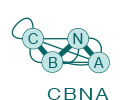
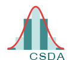
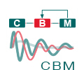

About Bio-IT 
-------------

The Bio-IT Project aims to develop and strengthen the bioinformatics community at EMBL Heidelberg. It is made up of members across a range of disciplines in computational biology, in different Units and Core Facilities. The project aims to improve the standard of computational biology practised at EMBL Heidelberg, to encourage collaborations, and to provide a forum for discussion of issues and ideas relevant to bioinformatics here. 
The activities of the project include::
- the organisation and delivery of training courses such as this one
- the provision of one-to-one training and consultancy
- the organisation of social and networking events for the computational biology community
- regular meetings to discuss issues and ideas
- the development and maintenance of the Bio-IT Portal <http://bio-it.embl.de>

The Portal hosts information regarding upcoming courses and conferences/other events relevant to computational biology, resources to help with your work, and profiles of people involved in bioinformatics at EMBL. It is accessible from within the EMBL network (you must connect via VPN for off-site access).

Centres
^^^^^^^
`EMBL Centres <http://www.embl.de/research/interdisciplinary_research/centres/index.html>`_ are 'horizontal', 
cross-departmental structures that promote innovative research projects across disciplines. All the EMBL Centres listed below
have a strong computational component.

|cbna| |csda| |cmci| |cbm|

Biomolecular Network Analysis
"""""""""""""""""""""""""""""

The `CBNA <http://bio-it.embl.de/cbna>`_ disseminates expertise, know-how and guidance in network integration and analysis throughout EMBL.

Statistical Data Analysis
"""""""""""""""""""""""""

The `CSDA <http://bio-it.embl.de/statistical-data-analysis>`_ helps EMBL scientists to use adequate statistical methods for their specific technological or biological applications.

Modeling
""""""""

The `Centre for Biological Modeling (CBM) <http://bio-it.embl.de/biological-modeling>`_ aims to support people to adopt mathematical modeling techniques into their everyday research.

