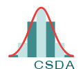
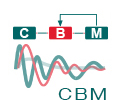

About Bio-IT 
-------------

Bio-IT is a community project aiming to develop and strengthen the
bioinformatics user community at EMBL Heidelberg. It is made up of members
across the different EMBL Heidelberg units and core facilities. The project
works to achieve these aims, firstly, by providing a forum for discussing and
sharing information and ideas on computational biology and bioinformatics,
focused on the `Bio-IT portal <http://bio-it.embl.de>`_. Secondly, we organise
and participate in a range of different networking and social activites aiming
to strengthen ties across the community.

Resources 
^^^^^^^^^^

A list of biocomputing-related resources associated with the project, in the
top-left "Resources" menu, including, for example there is help provided for
installing software on Linux computers at EMBL, instructions on using the Git
versions control system server provided by EMBL, and various other kinds of
information. 

Training and Outreach 
^^^^^^^^^^^^^^^^^^^^^^

The "Training and Outreach" menu provides information on events
(courses and conferences), both internal to EMBL and organised elsewhere by
other organisations, that are related to biocomputing and bioinformatics

Networking 
^^^^^^^^^^^

Several different kinds of networking events for the Bio-IT community are
being organised, including beer sessions for the EMBL community, and
within-Heidelberg events for the larger Heidelberg biocomputing community.

Biocomputing expertise at EMBL 
^^^^^^^^^^^^^^^^^^^^^^^^^^^^^^^

You can use the Bio-IT portal to search for people working at EMBL who have
experience working with data or tools you might be interested in. 

If you've not yet got a page up on the portal describing your own expertise,
please do so. If you need any help doing this, you can read about this in the
portal's FAQ section, or get in touch with one of the site administrators.

Centers
^^^^^^^
`EMBL Centres <http://www.embl.de/research/interdisciplinary_research/centres/index.html>`_ are 'horizontal', 
cross-departmental structures that promote innovative research projects across disciplines. All the EMBL Centres listed below
have a strong computational component.

.. |cbna| image:: _static/img-cbna.jpg
   :width: 20%
   :alt: CBNA
   :target: http://bio-it.embl.de/cbna

|cbna| |csda| |cmci| |cbm|

Biomolecular Network Analysis
"""""""""""""""""""""""""""""

The `CBNA <http://bio-it.embl.de/cbna>`_ disseminates expertise, know-how and guidance in network integration and analysis throughout EMBL.

Statistical Data Analysis
"""""""""""""""""""""""""

The `CSDA <http://bio-it.embl.de/statistical-data-analysis>`_ helps EMBL scientists to use adequate statistical methods for their specific technological or biological applications.

Molecular and Cellular Imaging
""""""""""""""""""""""""""""""

The `CMCI <http://bio-it.embl.de/molecular-and-cellular-imaging>`_ makes your life in image processing/analysis easier and more fun.

Modeling
""""""""

The `Centre for Biological Modeling (CBM) <http://bio-it.embl.de/biological-modeling>`_ aims to support people to adopt mathematical modeling techniques into their everyday research.

