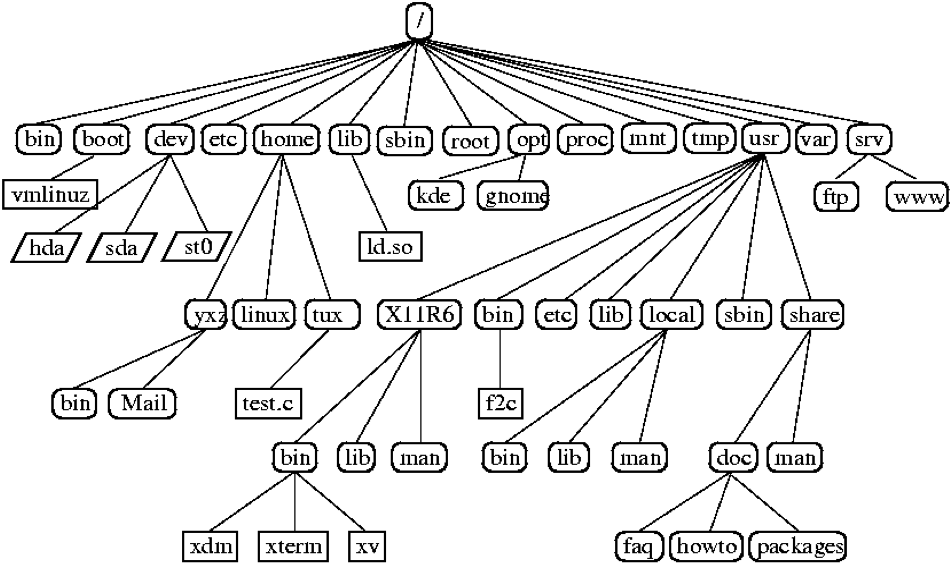

Introduction to the Linux Commandline
#####################################

Why Use the Commandline
=======================

-   It's **fast**. Productivity is a word that gets tossed around a lot by so-called power users, but the command line can really streamline your computer use, assuming you learn to use it right.
-   It's **easier to get help**. The command line may not be the easiest thing to use, but it makes life a whole lot easier for people trying to help you and for yourself when looking for help, especially over the internet. Many times it's as simple as the helper posting a few commands and some instructions and the recipient copying and pasting those commands. Anyone who has spent hours listening to someone from tech support say something like, “OK, now click this, then this, then select this menu command” knows how frustrating the GUI alternative can be. 
-   It's nearly **universal**. There are hundreds of Linux distros out there, each with a slightly different graphical environment. Thankfully, the various distros do have one common element: the command line. There are distro-specific commands, but the bulk of commands will work on any Linux system.
-   It's **powerful**. The companies behind those other operating systems try their best to stop a user from accidentally screwing up their computer. Doing this involves hiding a lot of the components and tools that could harm a computer away from novices. Linux is more of an open book, which is due in part to its prominent use of the command line.

General Remarks Regarding Using UNIX/Linux Systems
==================================================
-   **Test before run**. Anything written here has to be taken with a grain of salt. On another system – be it a different Linux distribution or another UNIXoid operating system – you might find the same command but without the support of some of the options tought here. It is even possible, that the same option has a different meaning on another system. With this in mind always make sure to test your commands (specially the “dangerous” ones which remove or modify files) when switching from one system to the other.
-   **The Linux/UNIX environment**. The behaviour of many commands is influenced or controlled by the so-called “environment”. This environment is the sum of all your environment variables. Some of these environment variables will be shown towards the end of this course.
-   **UPPERCASE, lowercase**. Don’t forget that everything is case-sensitive.
-   **The Filesystem**. Linux filesystems start on top at the root directory (sic!) “/” which hierarchically broadens towards the ground.  The separator between directories or directories and files in Linux is the slash (“/”).

  Depending on the Linux distribution you might or might not find all of above
  directories. Most important directories for you are ``/bin`` and ``/usr/bin``
  (sometimes also ``/usr/local/bin``) which contain the user software, ``/home`` which
  usually contains the users’ homedirectories and ``/tmp`` which can be used to store
  temporary data (beware: Its content is regularly removed!).

.. note:: The terms “directory” and “folder” are used interchangeably in this document.

General Structure of Linux Commands
===================================

Linux commands have the following general structure:

.. figure:: _static/LinuxCommandStructure.png

commandline options (sometimes called comandline switches) commonly have one of the two following forms: The short form ``-character`` or the long form ``--string.`` E.g.

 :: 

  > man -h
  > man --help

Short options are usually – though not always – concatenable:

 ::

  > ls -l -A -h
  > ls -lAh

Some options require an additional argument, which is added with a blank to the short form and with an equal sign to the long form:

 :: 

  > ls -I “*.pdf”
  > ls --ignore=”*.pdf”

Since Linux incorporates commands from different sources, options can be available in one or both forms and you’ll also encounter options with no dash at all and all kinds of mixtures:

 :: 

  > tar cf file.tar -C .. file/
  > ps auxgww

A Journey Through the Commands
==============================

Please note that all examples and usage instructions below are just a glimpse of what you can do and reflect our opinion on what’s important and what’s not. Most of these commands support many more options and different usages. Consult the manpages to find them.
Typographical conventions: Commands and examples are written in Courier.  User Input is written in Courier bold and placeholders are generally written in italic.

Getting Help
------------

``-h/--help`` option, no parameters

Many commands support a “help” option, either through ``-h`` or through ``--help``. 
Other commands will show a help page or at least a short usage overview if you provide wrong commandline options

man - show the manual page of a command
^^^^^^^^^^^^^^^^^^^^^^^^^^^^^^^^^^^^^^^

**Usage**: 
``man command or file``

 :: 

  > man man
  man(1)
  
  NAME
   man - format and display the on-line manual pages
  
  SYNOPSIS
   man [-acdfFhkKtwW] [--path] [-m system] [-p string] [-C config_file]
  [...]

For the navigation within a :index:`man <man>`-page see the chapter regarding less below.

.. note:: The behaviour of man is dependent of the $PAGER environment variable

apropos – list manpages containing a keyword in their description
^^^^^^^^^^^^^^^^^^^^^^^^^^^^^^^^^^^^^^^^^^^^^^^^^^^^^^^^^^^^^^^^^

**Usage**: ``apropos keyword``

 :: 

  > apropos who
  [...]
  > who                  (1)  - show who is logged on
  > who                  (1p)  - display who is on the system
  > whoami               (1)  - print effective userid

Use :index:`apropos` to find candidates for specific tasks

/usr/share/doc
^^^^^^^^^^^^^^

The ``/usr/share/doc`` directory in some Linux distributions contains additional documentation of installed software packages 

Who am I, where am I
--------------------

whoami – Print your username
^^^^^^^^^^^^^^^^^^^^^^^^^^^^

**Usage**: ``whoami``

 :: 

  > whoami
  fthommen

hostname – Print the name of the computer
^^^^^^^^^^^^^^^^^^^^^^^^^^^^^^^^^^^^^^^^^

**Usage**: ``hostname``

 :: 

  > hostname
  pc-teach01

pwd – Print the current working directory
^^^^^^^^^^^^^^^^^^^^^^^^^^^^^^^^^^^^^^^^^

**Usage**: ``pwd`` 

 :: 

  > pwd
  /home/fthommen

date – Print current date and time
^^^^^^^^^^^^^^^^^^^^^^^^^^^^^^^^^^

**Usage**: ``date``

 :: 

  > date
  Tue Sep 25 19:57:50 CEST 2012

.. note:: The command time does something completely different than :index:`date` and is not used to show the current time.

Moving Around
-------------

cd – Change the working directory
^^^^^^^^^^^^^^^^^^^^^^^^^^^^^^^^^

**Usage**: ``cd [new_directory]``

 :: 

  # pwd
  /home/fthommen
  # cd /usr/bin
  # pwd
  /usr/bin

Special directories:

- “``.``”:  The current working directory
- “``..``”: The parent directory of the current working directory
- “``~``”:  Your homedirectory

.. note:: Using :index:`cd` without a directory is equivalent to “``cd ~``” and changes into the users’s homedirectory
.. note:: Please note the difference between absolute pathes (starting with "``/``") and relative pathes (starting with a directory name)

::

  $ pwd
  /usr
  $ cd /bin
  $ pwd
  /bin

::

  > pwd
  /usr
  > cd bin
  > pwd
  /usr/bin

See What’s Around
-----------------

ls - List directory contents
^^^^^^^^^^^^^^^^^^^^^^^^^^^^

**Usage**:  
  ``ls [options] [file(s) or directory/ies]``

:: 

  > ls
  /home/fthommen
  > ls –l aa.pdf
  -rw-r--r-- 1 fthommen cmueller 0 Sep 24 10:59 aa.pdf

Useful options:

-l      Long listing with permissions, user, group and last modification date
-1      Print listing in one column only 
-a      Show all files (hidden, “.” and “..”)
-A      Show almost all files (hidden, but not “.” and “..”) 
-F      Show filetypes (nothing = regular file, “/” = directory, “*” = executable file, “@” = symbolic link)
-d      Show directory information instead of  directory content
-t      Sort listing by modification time (most recent on top)

----------

.. figure:: _static/LongListingDeconstructed.png

----------
 
Digression: Shell globs
^^^^^^^^^^^^^^^^^^^^^^^

Files and folders can’t only be referred to with their full name, but also with so-called “Shell Globs”, which are a kind of simple pattern to address groups of files and folders.  Instead of explicit names you can use the following placeholders:

- ``?:``  Any single character
- ``*:``  Any number of any character (including no character at all)
- ``[...]:``    One of the characters included in the brackets.  Use “-“ to define ranges  of characters

Examples:

- ``*.pdf:``  All files having the extension “.pdf”
- ``?.jpg:``  Jpeg file consisting of only one character
- ``[0-9]*.txt:`` All files starting with a number and having the extension “.txt”
- ``*.???:``  All files having a three-character extension

.. note:: The special directory “``~``” mentioned above is a shell glob, too.

Organize Files and Folders
--------------------------

touch – Create a file or change last modification date of an existing file
^^^^^^^^^^^^^^^^^^^^^^^^^^^^^^^^^^^^^^^^^^^^^^^^^^^^^^^^^^^^^^^^^^^^^^^^^^

**Usage**:  ``touch file(s) or directory/ies``

 :: 

  > ls afile
  ls: afile: No such file or directory
  > touch afile
  > ls afile
  afile

 :: 

  > ls –l aa.pdf
  -rw-r--r-- 1 fthommen cmueller 0 Sep 24 10:59 aa.pdf
  > touch aa.pdf
  > ls –l aa.pdf
  -rw-r--r-- 1 fthommen cmueller 0 Sep 25 22:01 aa.pdf

rm – Remove files and directories
^^^^^^^^^^^^^^^^^^^^^^^^^^^^^^^^^

**Usage**:  ``rm [options] file(s)``

 :: 

  rm –r [options] directory/ies
  > ls afile
  afile
  > rm afile
  > ls afile
  ls: afile: No such file or directory

**Useful options**: 

-i  Ask for confirmation of each removal
-r  Remove recursively
-f  Force the removal (no questions, no errors if a file doesn't exist)

.. note:: rm without the –i option will usually not ask you if you really want to remove the file or directory

mv – Move and rename files and folders
^^^^^^^^^^^^^^^^^^^^^^^^^^^^^^^^^^^^^^

**Usage**:  ``mv [options] sourcefile destinationfile``

 :: 

  mv [options] sourcefile(s) destinationdirectory
  > ls *.txt
  a.txt
  > mv a.txt b.txt
  > ls *.txt
  b.txt

**Useful options**: 

-i  Ask for confirmation of each removal

.. note:: You cannot overwrite an existing directory by another one with mv

mkdir – Create a new directory
^^^^^^^^^^^^^^^^^^^^^^^^^^^^^^

**Usage**:  ``mkdir [options] directory``

 :: 

  > ls adir/
  ls: adir/: No such file or directory
  > mkdir adir
  > ls adir

**Useful options**: 

-p   Create parent directories (when creating nested directories)

 :: 

  > mkdir adir/bdir
  mkdir: cannot create directory `adir/bdir': No such file or directory
  > mkdir –p adir/bdir

rmdir – Remove an empty directory
"""""""""""""""""""""""""""""""""

**Usage**:  ``rmdir directory``

 :: 

  > rmdir adir/

.. note:: If the directory is not empty, rmdir will complain and not remove it

cp – Copy files and folders
"""""""""""""""""""""""""""

**Usage**:  ``cp [options] sourcefile destinationfile``
.. note:: :index:`cp` [options] sourcefile(s) destinationdirectory

 :: 

  > cp P12931.fasta backup_of_P12931.fasta

**Useful options**:

-r      Copy recursively 
-i      Interactive operation, ask before overwriting an existing file 
-p      Preserve owner, permissions and timestamp 

View Files
^^^^^^^^^^

cat – Print files on terminal (concatenate)
"""""""""""""""""""""""""""""""""""""""""""

**Usage**:  ``cat [options] file(s)``

 :: 

  > cat  P12931.fasta backup_of_P12931.fasta
  [...]

.. note:: :index:`cat` only makes sense for short files or for e.g. combining several files into one.  See the redirection examples later

less – View and navigate files
""""""""""""""""""""""""""""""

**Usage**:  ``less [options] file(s)``

 :: 

  > less  P12931.fasta backup_of_P12931.fasta
  [...]

.. note:: This is the default “pager” for manpages under Linux unless you redefine your $PAGER environment variable

**Navigation within less**:

===================================    =======
Key(s):                                 Effect:
===================================    =======
up, down, right, left:                  use cursor keys
top of document:                        g
bottom of document:                     G
search:                                 “/” + search-term
find next match:                        n
find previous match:                    N 
quit:                                   q
===================================    =======

Extracting Informations from Files
^^^^^^^^^^^^^^^^^^^^^^^^^^^^^^^^^^

grep – Find lines matching a pattern in textfiles
"""""""""""""""""""""""""""""""""""""""""""""""""

:index:`Grep <grep>` is a command-line utility for searching plain-text data sets for lines matching a regular expression. 

**Usage**:  ``grep [options] pattern file(s)``

 :: 

  > grep -i ensembl P04637.txt
  DR   Ensembl; ENST00000269305; ENSP00000269305; ENSG00000141510. 
  DR   Ensembl; ENST00000359597; ENSP00000352610; ENSG00000141510. 
  DR   Ensembl; ENST00000419024; ENSP00000402130; ENSG00000141510. 
  DR   Ensembl; ENST00000420246; ENSP00000391127; ENSG00000141510. 
  DR   Ensembl; ENST00000445888; ENSP00000391478; ENSG00000141510. 
  DR   Ensembl; ENST00000455263; ENSP00000398846; ENSG00000141510. 

**Useful options**:

-v      Print lines that do not match
-i      Search case-insensitive
-l      List files with matching lines, not the lines itself
-L      List files without matches
-c      Print count of matching lines for each file

head – Print first lines of a textfile
""""""""""""""""""""""""""""""""""""""

:index:`Head <head>` is a program on Unix and Unix-like systems used to display the beginning of a text file or piped data.

**Usage**:  ``head [options] file(s)``

 :: 

  > head /etc/passwd
  root:x:0:0:root:/root:/bin/bash
  bin:x:1:1:bin:/bin:/sbin/nologin
  daemon:x:2:2:daemon:/sbin:/sbin/nologin
  adm:x:3:4:adm:/var/adm:/sbin/nologin
  lp:x:4:7:lp:/var/spool/lpd:/sbin/nologin
  sync:x:5:0:sync:/sbin:/bin/sync
  shutdown:x:6:0:shutdown:/sbin:/sbin/shutdown
  halt:x:7:0:halt:/sbin:/sbin/halt
  mail:x:8:12:mail:/var/spool/mail:/sbin/nologin
  news:x:9:13:news:/etc/news:

**Useful options**:

-n num  Print num lines (default is 10)

tail – Print last lines of a textfile
"""""""""""""""""""""""""""""""""""""

**Usage**:  ``tail [options] file(s)``

 :: 

  > tail –n 3 /etc/passwd
  xfs:x:43:43:X Font Server:/etc/X11/fs:/sbin/nologin
  gdm:x:42:42::/var/gdm:/sbin/nologin
  sabayon:x:86:86:Sabayon user:/home/sabayon:/sbin/nologin

**Useful options**:

-n num  Print num lines (default is 10)
-f      "Follow" a file (print new lines as they are written to the file)

Useful Filetools
^^^^^^^^^^^^^^^^

file – determine the filetype
"""""""""""""""""""""""""""""

**Usage**:  ``file [options] file(s)``

 :: 

  > file /bin/date
  /bin/date: ELF 32-bit LSB executable
  > file /bin
  /bin: directory
  > file SRC_HUMAN.fasta
  SRC_HUMAN.fasta: ASCII text

.. note:: The command :index:`file` uses certain tests and some magic to determine the type of a file

which – find a (executable) command
"""""""""""""""""""""""""""""""""""

**Usage**:  ``which [options] command(s)``

 :: 

  > which date
  /bin/date
  > which eclipse
  /usr/bin/eclipse
  >

find – search/find files in any given directory
"""""""""""""""""""""""""""""""""""""""""""""""

**Usage**:  ``find [starting path(es)] [search filter]``

 :: 

  > find /etc
  /etc
  /etc/printcap
  /etc/protocols
  /etc/xinetd.d
  /etc/xinetd.d/ktalk
  [...]
  >

``find`` :index:`is <find>` a powerful command with lots of possible search filters.  Refer to the manpage for a complete list.  

**Examples**:

- Find by name: 

 :: 

  > find . -name SRC_HUMAN.fasta
  ./SRC_HUMAN.fasta

- Find by size: (List those entries in the directory /usr/bin that are bigger than 500kBytes)

 :: 

  > find /usr/bin -size +500k
  /usr/bin/oparchive
  /usr/bin/kiconedit
  /usr/bin/opjitconv
  [...]

- Find by type (d=directory, f=file, l=link) 

 :: 

  > find . -type d
  .
  ./adir

Useful Terminal Tools
^^^^^^^^^^^^^^^^^^^^^

clear – Clear the “screen”
""""""""""""""""""""""""""

**Usage**:  ``clear``

 :: 

  > clear

In case the output of the terminal/screen gets cluttered, you can use ``clear`` to :index:`clear` the screen... 

If this doesn't work, you can use ``reset`` to perform a re-initialization of the terminal:

reset – Reset your terminal
"""""""""""""""""""""""""""

**Usage**:  ``reset [options]``

 :: 

  > reset

Permissions
^^^^^^^^^^^

using ls -l to view entries of current directory: 

 :: 

  > ls –l
  drwxr-xr-x 2 dinkel gibson 4096 Sep 17 10:46 adir
  lrwxrwxrwx 1 dinkel gibson   15 Sep 17 10:45 H1.fasta -> H2.fasta
  -rw-r--r-- 1 dinkel gibson  643 Sep 17 10:45 H2.fasta

.. figure:: _static/LinuxPermissions.png

Changing Permissions
""""""""""""""""""""

Permissions are set using the ``chmod`` (:index:`change mode<chmod>` ) command. 
**Usage**:  ``chmod [options] mode(s) files(s)``

 :: 

  > ls –l adir
  drwxr-xr-x 2 dinkel gibson 4096 Sep 17 10:46 adir
  > chmod u-w,o=w adir
  > ls –l adir
  dr-xr-x-w- 2 dinkel gibson 4096 Sep 17 10:46 adir

The mode is composed of

+-----+---------------+------+------------------------------+-----+--------------+
| Who                 | What                                |  Which permission  |
+=====+===============+======+==============================+=====+==============+
| u:  |  user/owner   |  +:  | add this permission          |  r: | read         |
+-----+---------------+------+------------------------------+-----+--------------+
| g:  |  group        |  -:  | remove this permission       |  w: | write        |
+-----+---------------+------+------------------------------+-----+--------------+
| o:  |  other        |  =:  | set exactly this permission  |  x: | execute      |
+-----+---------------+------+------------------------------+-----+--------------+
| a:  |  all          |  xx  | xx                           | xx  |  xx          |
+-----+----------------+-----+------------------------------+-----+--------------+

Add executable permission to the group: 

 :: 

  > chmod g+x file

Revoke this permission: 

 :: 

  > chmod g-x file

Allow all to read a directory: 

 :: 

  > chmod a+rx adir/

Remote access
^^^^^^^^^^^^^

To execute commands at a remote machine/server, you need to log in to this machine. This is done using the ``ssh`` command (secure shell). 
In its simplest form, it takes just the machinename as parameter (assuming the username on the local machine and remote machine are identical): 

 :: 

  > ssh remote_server

.. note:: Once logged in, :index:`use <hostname, whoami>` ``hostname,`` ``whoami,`` etc. to determine on which machine you are currently working!

To use a different username, you can use either: 

 :: 

  > ssh username@remote_server

or 

 :: 

  > ssh -l username remote_server

When connecting to a machine for the first time, it might display a warning: 

 :: 

  > ssh sub-master
  The authenticity of host 'sub-master (10.11.4.84)' can't be established. 
  RSA key fingerprint is 47:a4:0f:7b:c2:0f:ef:91:8e:65:fc:3c:f7:0c:53:8d. 
  Are you sure you want to continue connecting (yes/no)?

Type *yes* here.
If this message appears a second time, you should contact your IT specialist...

To :index:`disconnect <exit, disconnect>` from the remote machine, type: 
 :: 

  > exit

Copying files to and from remote computers can be done using ``scp``  (secure copy). 
The order of parameters is the same as in ``cp``: first the name of the source, then the name of the destination. Either one can be the remote part.

 :: 

  > scp localfile server:/remotefile

  > scp server:/remotefile localfile

An alternative username can be provided just as in ssh:

 :: 

  > scp username@server:/remotefile localfile

IO and Redirections
^^^^^^^^^^^^^^^^^^^

Redirect
""""""""

:index:`Redirect <redirect>` the output of one program into e.g. a file: (Caution: you can easily overwrite files by this!) 
Inserting the current date into a new file: 

 :: 

  > date > file_containing_date

:index:`Filtering <grep>` lines containing the term “src” from FASTA files and inserting them into the file lines_with_src.txt: 

 :: 

  > cd /exercises/
  > grep -i "src" *.fasta > lines_with_src.txt

Append
""""""

:index:`Append <append>` something to a file (rather than overwriting it): 

 :: 

  > date >> file_containing_date

Pipe
""""

Use the :index:`| <|, pipe>` pipe symbol (``|``) to feed the output of one program into the next program. 
Here: use ``ls`` to show the directory contents and then :index:`use <grep>` ``grep`` to only show those that contain fasta in their name: 

 :: 

  > cd /exercises
  > ls | grep fasta
  EPSINS.fasta
  FYN_HUMAN.fasta
  P12931.fasta
  SRC_HUMAN.fasta

Environment Variables
^^^^^^^^^^^^^^^^^^^^^

:index:`Environment variables <environment variables>` are a set of dynamic named values that can affect the way running processes will behave on a computer.

$HOME
"""""

Contains the location of the user's home directory. Although the current user's home directory can also be found out through the 
C functions ``getpwuid`` and ``getuid,`` :index:`$HOME` is often used for convenience in various shell scripts (and other contexts).

.. note:: Do not change this variable unless you have a good reason and you know what you are doing!

$PATH
"""""

:index:`$PATH` contains a colon-separated list of directories that the shell searches for commands that do not contain a slash in their name 
(commands with slashes are interpreted as file names to execute, and the shell attempts to execute the files directly).

$PAGER
""""""

The :index:`$PAGER` variable contains the path to the program used to list the contents of files through (such :index:`as <less>` ``less`` :index:`or <more>` ``more``).

$PWD
""""

The :index:`$PWD` variable points to the current directory. Equivalent to the output of the command ``pwd`` when called without arguments.

Displaying environment variables:
^^^^^^^^^^^^^^^^^^^^^^^^^^^^^^^^^

:index:`Use <environment variables; display>` ``echo`` to :index:`display <echo>` individual variables `set`` :index:`or <env>` ``env`` to view all at once:

 :: 

  > echo $HOME
  /localhome/teach01
  > set
  ...
  > env
  ...

Setting an environment variable:
^^^^^^^^^^^^^^^^^^^^^^^^^^^^^^^^

Use ``export`` followed by the variable name and the value of the variable (separated by the equal sign) to :index:`set <environment variables; set, set, export>` an environment variable:

 :: 

  > export PAGER=/usr/bin/less

.. note:: An environment variable is only valid for your current session. Once you logout of your current session, it is lost or reset.

