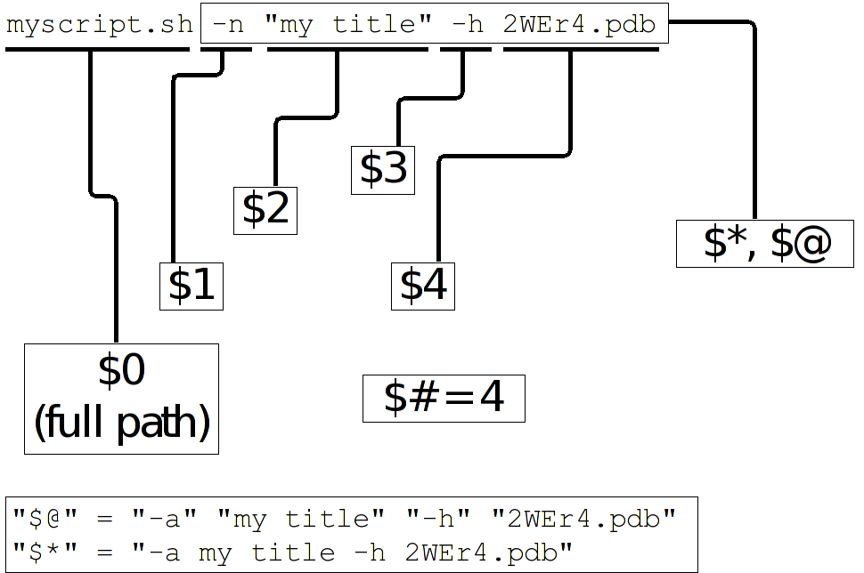
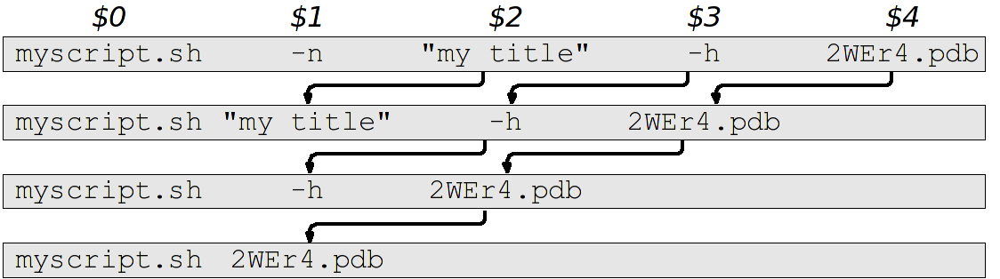

*********************
Basic Shell Scripting
*********************

What is a Script?
==================

A script is nothing else than a number of shell command place together in a file. The simplest
script is maybe just a complex oneliner that you don't want to type each time again. More
complex scripts are seasoned with control elements (conditions and loops) which allow for a
sophisticated command flow. scripts might allow for configuration and customization, thus allowing
one script to be flexibly used in several different environments. Whatever you do in a script, you
can also do on the commandline. This is also the first way to test your scripts step by step!

Script Naming and Organization
==============================

It is good practice - though not technically required - to give your scripts an extension
which specifies their type. I.e. "`.sh`" for Bourne Shell and Bourne Again Shell scripts, "`.csh`"
for C-Shell scripts. Sometimes "`.bash`" for Bourne Again Shell scripts is used.
We recommend to either store all scripts in one location (e.g. ~/bin) and add this location to
your $PATH variable or to store the scripts together with the files that are processed by the
script.
If you use scripts to process data, then the scripts should probably be archived together with the data files...

Running a Script
================

There are basically three ways to run a script:

a) the location to your script is not in your $PATH variable, then you have to specify the
full path to the script:

 ::

  /here/is/my/script.sh
   [...]

b) the location to the script is in the $PATH variable, then you can simply type its name:

  ::

   script.sh
    [...]

In both situations, the script will need to have execute permissions to be run. If for some
reason you can only read but not execute the script, then it can still be run in the following way:

c) specifying the interpreter. The full path (relative or absolute) to the script has to be provided in
this case, no matter whether the script location is already contained in $PATH or not:

 ::

  /bin/sh /here/is/my/script.sh
   [...]

Basic Structure of a Shellscript
--------------------------------

Shellscripts have the following general structure:

#. A line starting with "`#!`! which defines the interpreter (i.e. the program used to run the
   script). This line is called the "`shebang line` and must be the first line in a script.

#. A section where the configuration takes place, e.g. paths, options and commands are defined and it is made sure, that all prerequisites are met.

#. A section where the actual processing is done. This includes error handling.

#. A controlled exit sequence, which includes cleaning up all temporary files and returning a sensible exit status.

This is merely a recommendation to keep your scripts well structured. None of these sections are mandatory.

Readability and Documentation
-----------------------------

Make your script easily readable. Use comments and whitespace and avoid super compact
but hard to understand command lines. Always take into account that not only the shell,
but also human beings will probably have to read and understand your script.
(see :ref:`Breaking up long lines<breaking_up_long_lines>`)
Even if your script is very simple - document it! This helps others understand what you did,
but - most important - it helps you remember what you did, when you have to reuse the
script in the future.

Documentation is done either by writing comments into the script or by creating a special documentation file (README.txt or similar). Documenting in the script can be done in several ways:

#. A preamble in the script, outlining the purpose, parameters and variables of the script as well
   as some information about authorship and and perhaps changes.

#. Within the script as blocks of text or "End of line" comments.

To write a comments use the hash sign ("`#`"). Everything after a "`#`" is ignored when executing a script.

Let's have a look at the following script, breaking it down into individual parts.
First, the full script:

.. literalinclude:: _static/myscript.sh
   :language: bash
   :linenos:

It starts with the "shebang line":

.. literalinclude:: _static/myscript.sh
   :language: bash
   :lines: 1-3
   :emphasize-lines: 1

Next is the preamble with a short description, usage information, authorship etc.:

.. literalinclude:: _static/myscript.sh
   :language: bash
   :lines: 3-13

Followed by the configuration:

.. literalinclude:: _static/myscript.sh
   :language: bash
   :lines: 14-16

Next, checking prerequisites and sane environment:

.. literalinclude:: _static/myscript.sh
   :language: bash
   :lines: 17-30

This is what you actually wanted to do:

.. literalinclude:: _static/myscript.sh
   :language: bash
   :lines: 31-33

Finally, ensure a valid and meaningful exit status:

.. literalinclude:: _static/myscript.sh
   :language: bash
   :lines: 34-

.. _reporting_success_or_failure:

Reporting Success or Failure - The Exit Status
----------------------------------------------

Commands report their success or failure by their exit status. An exit status
of 0 (zero) indicates success, while any exit status greater then 0 indicates
an error.  Some commands report more than one error status.  Refer to the
respective manpages to see the meanings of the different exit stati. The exit
status of a script is usually the exit status of the last executed command,
which is reported by the environment variable `$?`:

`$?`:
        The exit status of the last run command

See :ref:`Ensuring a Sensible Exit Status<ensuring_sensible_exit_status>` about 
how to control the exit status of your script.

Command Grouping and Sequences
------------------------------

Execute commands in sequence:
    Commands can be concatenated to be executed one after the other unconditionally
    or based on the success of the respective previous command:

     ::

      cmd1; cmd2

    Example:
        Create a directory and change into it:
        ::

         > pwd
         /home/fthommen
         > mkdir a; cd a
         > pwd
         /home/fthommen/a

Execute cmd2 only if cmd1 was successful:
     ::

      cmd1 && cmd2

    Example:
        Confirm that /etc exists:::

         > cd /etc && echo "/etc exists"
         /etc/exists

Execute cmd3 only if cmd1 was not successful:
     ::

      cmd1 || cmd2

Example:
    Warn if a directory doesn't exist: ::

        > cd /etc || echo "/etc is missing!"
        > cd /nowhere >&/dev/null || echo "/nowhere does not exist"
        /nowhere does not exist

Group commands to create one single output stream:
    The commands are run in a subshell (i.e. a new shell is opened to run them) ::

     ( cmds )

    Example:
        Change into /etc and list content. You are still in the same directory as you were before:::

         > pwd
         /home/fthommen
         > (cd /etc; ls)
         [... directory listing here ...]
         > pwd
         /home/fthommen

Group commands to create one single output stream:
    The commands are run in the current (!) shell. The opening "{" must be followed by a blank and the last command must be succeeded by a ";". ::

      { cmds; }

    Example:
        Change into /etc and list content. You are still in /etc after the bracketed expression (compare to the example above): ::

         > pwd
         /home/fthommen
         > { cd /etc; ls; }
         [... directory listing here ...]
         > pwd
         /etc

Control Structures
==================

The following syntax elements will be described for sh/bash and for csh/tcsh.
However since this course is mainly about sh/bash, examples will only be given
for sh/bash. Some notes about csh/tcsh specialities might be given in the text.
This is only a selection of the most useful or most common elements. There are
much more in the manpages. All shells offer myriads of possibilities which
cannot possibly be demonstrated in this course. Some of the described
features might be specific to bash and not be available in a classical Bourne
Shell on other systems.

Conditional Statements
----------------------

if - then - else:
^^^^^^^^^^^^^^^^^

This is the most basic conditional statement: Do something depending on certain conditions. The basic syntax is:

  sh/bash: ::

   if condition1
   then
     commands
   elif condition2
     more commands
   [...]
   else
     even more commands
   fi

  csh/tcsh: ::

    if (condition) then
      commands
    else if (condition2) then
      more commands
    [...]
    else
      even more commands
    endif

Conditions can be 
either the **exit status of a command** or 
the **evaluation of a logical or arithmetic expression**:

A) Evaluating the exit status of a command: Simply use the command as condition. For example: ::

     if grep -q root /etc/passwd
     then
       echo root user found
     else
       echo No root user found
     fi

.. Note:: To evaluate the exit status of a command in csh/tcsh, it must be
            placed within curly brackets with blanks separating the brackets from the
            command: ``if ({ grep -q root /etc/passwd }) then [...]``
     
.. Note:: Redirect the output of the command to be evaluated to /dev/null if you are only interested in the exit status and if the command doesn't have a "quiet" option.
     
.. Note:: Redirection of commands in conditions does not work for csh/tcsh

B) Evaluating of conditions or comparisons:

Conditions and comparisons are evaluated using a special command test which is
usually written as "[" (no joke!). As "[" is a command, it must be followed by
a blank. As a speciality the "[" command must be ended with " ]" (note the
preceding blank here)

.. Note:: In csh/tcsh the test (or [) command is not needed. Conditions and comparisons are directly placed within the round braces.

+------------+---------------------------------------+-----------+
|  sh/bash   | File condition                        | csh/tcsh  |
+============+=======================================+===========+
|  -e *file* | *file* exists                         | -e *file* |
+------------+---------------------------------------+-----------+
|  -f *file* | *file* exists and is a regular *file* | -f *file* |
+------------+---------------------------------------+-----------+
|  -d *file* | *file* exists and is a directory      | -d *file* |
+------------+---------------------------------------+-----------+
|  -r *file* | *file* exists and is readable         | -r *file* |
+------------+---------------------------------------+-----------+
|  -w *file* | *file* exists and is writeable        | -w *file* |
+------------+---------------------------------------+-----------+
|  -x *file* | *file* exists and is executable       | -x *file* |
+------------+---------------------------------------+-----------+
|  -s *file* | *file* exists and has a size > 0      |           |
+------------+---------------------------------------+-----------+
|            | *file* exists and has zero size       | -z *file* |
+------------+---------------------------------------+-----------+

+-----------+---------------------------------+----------------+
|  sh/bash  | String Comparison               | csh/tcsh  test |
+===========+=================================+================+
|  -n s1    | String s1 has non-zero length   |                |
+-----------+---------------------------------+----------------+
|  -z s1    | String s1 has zero length       |                |
+-----------+---------------------------------+----------------+
|  s1 = s2  | Strings s1 and s2 are identical | s1 == s2       |
+-----------+---------------------------------+----------------+
|  s1 != s2 | Strings s1 and s2 differ        | s1 != s2       |
+-----------+---------------------------------+----------------+
|  string   | String string is not null       |                |
+-----------+---------------------------------+----------------+

+-----------+-----------------------------------+----------+
|  sh/bash  | Integer Comparison                | csh/tcsh |
+===========+===================================+==========+
| n1 –eq n2 | n1 equals n2                      | n1 == n2 |
+-----------+-----------------------------------+----------+
| n1 –ge n2 | n1 is greater than or equal to n2 | n1 >= n2 |
+-----------+-----------------------------------+----------+
| n1 –gt n2 | n1 is greater than n2             | n1 > n2  |
+-----------+-----------------------------------+----------+
| n1 –le n2 | n1 is less than or equal to n2    | n1 <= n2 |
+-----------+-----------------------------------+----------+
| n1 –lt n2 | n1 is less than n2                | n1 < n2  |
+-----------+-----------------------------------+----------+
| n1 –ne n2 | n1 it not equal to n2             | n1 != n2 |
+-----------+-----------------------------------+----------+

+--------------------+------------------------------------------------------+--------------------+
|  sh/bash           | Combination of conditions                            | csh/tcsh           |
+====================+======================================================+====================+
| ! *cond*           | True if condition *cond* is not true                 | ! *cond*           |
+--------------------+------------------------------------------------------+--------------------+
| *cond1* –a *cond2* | True if conditions *cond1* and *cond2* are both true | *cond1* && *cond2* |
+--------------------+------------------------------------------------------+--------------------+
| *cond1* –o *cond2* | True if conditions *cond1* or *cond2* is true        | *cond1* || *cond2* |
+--------------------+------------------------------------------------------+--------------------+

Examples: Test for the existence of /etc/passwd::

    if [ -e /etc/passwd ]
    then
      echo /etc/passwd exists
    else
      echo /etc/passwd does NOT exist
    fi

or::

    if test -e /etc/passwd
    then
      echo /etc/passwd exists
    else
      echo /etc/passwd does NOT exist
    fi

.. Note:: Bash supports an additional way of evaluating conditional expressions
          with [[ expression ]]. This syntax element allows for more readable expression
          combination and handles empty variables better. However it is not backwards
          compatible with the original Bourne Shell. See the bash manpage for more
          information

case
^^^^

The :index:`case <case>`  statement implements a more compact and better readable form of if -
:index:`elif <elif>`  - elif - elif etc. Use this if your variable (and you can only check for
variables with case) can have a distinct number of valid values. A typical
usage of case will follow later.

The basic syntax is:

sh/bash: ::

   case variable in
     pattern1)
       commands
       ;;
     pattern2)
       commands
       ;;
     [...]
     *)
       commands
       ;;
   esac

:index:`csh/tcsh <breaksw>`: ::

   switch (variable)
     case pattern1:
       commands
       breaksw
     case pattern2:
       commands
       breaksw
     default:
       commands
   endsw

.. Note:: "``*``", "``?``" and "``[...]``" can be used for the :index:`patterns <pattern>`

.. Note:: The "``*)``" (sh/bash) and "``default:``" (csh/tcsh) patterns are "catch-all" patterns which match everything not matched above. It is often used to detect invalid values of variable.

.. Note:: Multiple patterns can be handled by separating them with "|" in sh/bash or by successive case statements in csh/tcsh.

Example:
  Check if /opt/ or /usr/ paths are contained in ``$PATH``:::

     case $PATH in
      */opt/* | */usr/* )
         echo /opt/ or /usr/ paths found in \$PATH
         ;;
      *)
         echo '/opt and /usr are not contained in $PATH'
         ;;
     esac

Loops
-----

for / foreach
^^^^^^^^^^^^^

The :index:`for <for>`  and :index:`foreach <foreach>`  statements respectively will loop through a
list of given values and run the given statements for reach run:

 sh/bash: ::

     for variable in list
     do
       commands
     done

 csh/tcsh: ::

     foreach variable (list)
       commands
     end

*list* is a list of strings, separated by whitespaces

Examples:
 List all files in /tmp in a bulleted list: ::

     for FILE in /tmp/*
     do
       echo " * $FILE"
     done
     or
     for FILE in `ls /tmp`
     do
       echo " * $FILE"
     done

while / until
^^^^^^^^^^^^^

The :index:`while <while>` and :index:`until <until>` loops execute your commands while (or :index:`until <until>` respectively) a certain condition is met

 sh/bash: ::

   while condition
   do
     commands
   done

   until condition
   do
     commands
   done

 csh/tcsh: ::

   while (condition)
     commands
   end

The conditions are constructed the same way as those used in if statements.

.. Note:: The :index:`until <until>` statement is not available in csh/tcsh.

"Manual" loop control
^^^^^^^^^^^^^^^^^^^^^

Instead of (or additionally to) the built-in loop control in for/foreach, :index:`while <while>` and
:index:`until <until>`  loops, you can control exiting and continuing them with "``break``" and
"``continue``": break "``breaks out``" of the innermost loop (loops can be nested!) and continues
after the end of the loop. ``continue`` skips the rest of the current (innermost) loop and starts
the next iteration

Making Scripts Flexible
=======================

Scripts are most useful, if they can be reused. Copying scripts and changing
them to fit the new situation is time-consuming and error-prone. Additionally
if you add an improvement to the current script, then all previous versions
will stay without it. Having one script with the possibility to configure it,
is usually the better way. Customization of scripts can be achieved by either
using variables or by adding the possibility to use your own commandline
options and arguments.

Configurable Scripts
--------------------

Any value - be it paths, commands or options - that is specific to individual
applications or your script, should not be "hardcoded" (i.e. used literally
within the script) but assigned to variables:

Using Variables
^^^^^^^^^^^^^^^

Any value - be it paths, commands or options - that is specific to individual
applications or your script, should not be "hardcoded" (i.e. used literally
within the script) but assigned to variables:

Bad example:
You have to change two instances of the path each time you want to list an other directory: ::

    #!/bin/sh

    echo "The directory /etc contains the following files:"
    ls /etc

Good example:
The path is now in a variable and only one instance has to be changed each time (less work, less errors): ::

    #!/bin/sh

    MYDIR=/etc

    echo "The directory $MYDIR contains the following files:"
    ls $MYDIR

Of course, you'll still have to modify the script each time you want to list the content of an other directory. A more flexible way of customization would be to use a settings file.

Using a Settings File
^^^^^^^^^^^^^^^^^^^^^

Instead of having your configurable section within the script, it can be
"outsourced" in its own file. This file is basically a shellscript which is run
within the primary script. To run commands from a file within the current
environment, the commands source (bash, csh/tcsh) or . (dot) (sh/bash) are
used:

The settings file, e.g. settings.ini: ::

    MYDIR=/etc

The script: ::

    #!/bin/sh

    . ./settings.ini

    echo "The directory $MYDIR contains the following files:"
    ls $MYDIR

Defining your own Commandline Options and Arguments
---------------------------------------------------

The best way to configure a script is to allow for your own commandline options
and arguments. Commandline arguments are available the script as so-called
positional parameters $1, $2, $3: etc. $0: contains the name of the script. The
variables important when dealing with commandline parameters are:

$0:
        path to the script.  Either the path as you specified it or the full path if the script was executed through $PATH
$1, $2, $3, etc:
        Positional parameters (i.e. commandline arguments)
$#:
        Current number of positional parameters
$*:
        All positional parameters. If used within double quotes ("$*"), then it will expand to the list of all positional parameters, where the complete list is quoted
$@:
        All positional parameters. If used within double quotes ("$@"), then it will expand to the list of all positional parameters, where each parameter is individually quoted

If you run the script ::

    #!/bin/sh
    echo The script is $0
    echo The first commandline option is $1
    echo The second commandline option is $2

with two arguments, you'll get the following output: ::

    # ./script.sh ABC DEF
    The script is ./script.sh
    The first commandline option is ABC
    The second commandline option is DEF
    #

In many cases you'll not know how many parameters are given on the commandline.
In these cases you can use shift to loop through them. shift removes $1 and
moves all other positional parameters one position to the right: $2 becomes $1,
$3 becomes $2 etc.:

With the help of "$#", ":index:`shift <shift>`", ":index:`case <case>`"  and the positional parameters we can now check
all the commandline parameters: ::

    while [ "$#" -gt 0 ]
    do
      case $1 in
        -h) echo "Sorry, no help available!"  # not very helpful, is it?
            exit 1                            # exit with error
            ;;

        -v) VERBOSE=1                         # we may use $VERBOSE later
            ;;

        -f) shift
            FILE=$1                           # Aha, -f requires an
                                              # additional argument
            ;;

        *)  echo "Wrong parameter!"
            exit 1                            # exit with error
      esac
      shift
    done

.. _ensuring_sensible_exit_status:

Ensuring a Sensible Exit Status
===============================

If you don't provide your own exit status, then the script will return the exit
status of the last executed command (See :ref:`Reporting Success or Failure - The Exit Status<reporting_success_or_failure>`).
In many cases this might be what you want, but very
often it isn't. Consider the following script which is a real example from real
life and happened to me personally: ::

    #!/bin/sh

    [... do something that fails ...]

    echo "End of the script"

This script will *always* succeed, as the echo command hardly ever fails. You
will - from the exit status of the script - never be able to detect that
something went wrong. Instead in such cases you should manually handle the exit
codes of the commands that are run within the script.

With it's help we can keep track of the exit stati of all our important
processing steps and finally return a sensible value: ::

    #!/bin/sh
    mystatus=0;

    [... do something that might fail ...]
    if [ $? -ne 0 ]
    then
      mystatus=1
    fi

    [... do something else that might fail, too ...]
    [ $? -ne 0 ] && mystatus=1         # same as above.  Do you understand
                                       # this?

    echo "End of the script"
    exit $mystatus

Why is the exit status important after all?
-------------------------------------------

First when you use your script within other scripts, you'll probably need to be
able to check, if it has succeeded.  There might be other ways (e.g. checking
outputfiles for certain strings, checking directly the textual output of the
script etc.), but these ways are usually cumbersome and require lots of coding.
Exit values are easy to check.
Second: Other tools and systems might also use the exit status of your script.
E.g. the cluster system uses your job's exit status to assess, if it has run
successfully or not.  Returning success even in case of failure will result in
lots of complications in case a problem occurs. It took me several days to
realize the bug above.

Tips and Tricks
===============

Combining Variables with other Strings
--------------------------------------

When combining variables with other strings, then in some situations the
variable name must be placed in curly brackets ("{}"): ::

    # A=Heidel
    # echo $Aberg

    # echo ${A}berg
    Heidelberg
    #

Filenames and Paths
-------------------

If possible, try to avoid any special characters (blanks, semicolons (";"),
colons (":"), backslashes ("\") etc.) in file and directory names.  All these
special characters can lead to problems in scripted processing.  Instead, stick
to alphanumeric characters (a-z, 0-9), dots ("."), dashes ("-") and underscores
("_").  Additionally sticking to lowercase characters helps avoiding mistypes
and makes the automatic filename expansion easier.

.. _breaking_up_long_lines:

Breaking up Long Code Lines
---------------------------

Code lines can become pretty long and unreadable, wrapping onto the next line
etc.  You can use the escape character (backslash, "\") to break them up and
enhance readability of your script.  The excape character must immediately be
followed by a newline (no intermediate blanks or other is allowed): ::

    # bsub -o output.log -e error.log -q clngnew -M 150000 -R "select[(mem > 15000)]" /g/software/bin/pymol-1.4 -r -p < pymol.pml

becomes: ::

    # bsub -o output.log \
           -e error.log \
           -q clngnew \
           -M 150000 \
           -R "select[(mem > 15000)]" \
        /g/software/bin/pymol-1.4 -r -p < pymol.pml

Which is way better to read and to maintain

Script Debugging
----------------

sh/bash and csh/tcsh have both an option "-x" which helps debugging a script by
echoing each command before executing it.  This option can be set and unset
during runtime with set -x / set +x (sh/bash) and set echo / unset echo
(csh/tcsh).

Command Substitution
--------------------

You can use the output of a command and assign it to a variable or use it right
away as text string, by using the command substitution operators "`"
(backticks, backquotes) or "$(...)". The backtick operator works in all shells,
while $(...) only works in bash.

Three variants for the same (print out who you are in English text): ::

    # ME=`whoami`
    # echo I am $ME
    I am fthommen
    #

    # ME=$(whoami)
    # echo I am $ME
    I am fthommen
    #

    # echo I am `whoami`
    I am fthommen
    #

Create Temporary Files
----------------------

You can create temporary files with mktemp. By default it will create a new
file in /tmp and print its name: ::

    # mktemp
    /tmp/tmp.Yaafh19370
    #

Cleaning up Temporary Files
---------------------------

It is considered good practice and sometimes even important, to clean up
temporary data before ending a script. A simple way - which will not cover all
cases, though - could be to store all created temporary files in a variable and
remove them all before exiting the script: ::

    #! /bin/sh
    ALL_TEMPFILES=""     # store a list of all temporary files here

    TEMPFILE1=`mktemp`
    ALL_TEMPFILES="$ALL_TEMPFILES $TEMPFILE1"

    TEMPFILE2=`mktemp`
    ALL_TEMPFILES="$ALL_TEMPFILES $TEMPFILE2"

    [... process, process, process ...]

    rm -f $ALL_TEMPFILES
    exit
